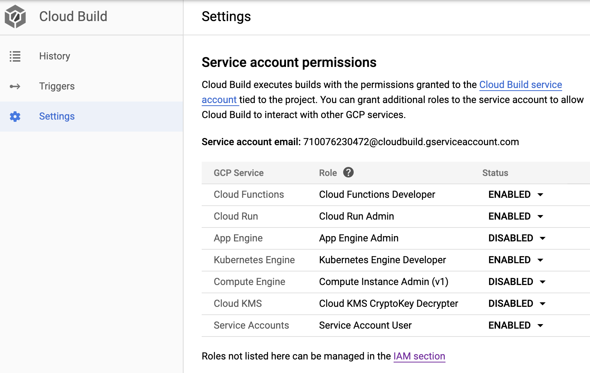
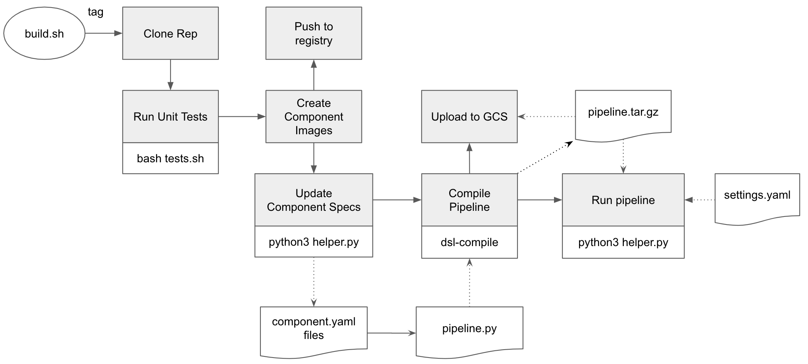

# A Simple CI/CD Example with Kubeflow Pipelines and Cloud Build

This repository shows a simple example for Kubeflow Pipelines (KFP) and
Cloud Build. The aim from this example is to:
1. Create KFP components with inputs and outputs.
2. Show how to **organise the repository structure** for implementing your 
components (source code, unit tests, Dockerfiles, specs, and pipeline workflow and settings).
2. How to **perform build and deploy** for your pipeline using Cloud Build. 

## Requirements

You need to have your [GCP Project](https://cloud.google.com/resource-manager/docs/creating-managing-projects).
You can use [Cloud Shell](https://cloud.google.com/shell/docs/quickstart) 
or [gcloud CLI](https://cloud.google.com/sdk/) to run all the commands in this
guideline.

## Setup 

### 1. GCP project setup

Follow the [instruction](https://cloud.google.com/resource-manager/docs/creating-managing-projects) and create a GCP project. 
Once created, enable the Dataflow API, BigQuery API in this [page](https://console.developers.google.com/apis/enabled).
You can also find more details about enabling the [billing](https://cloud.google.com/billing/docs/how-to/modify-project?#enable-billing).

We recommend to use CloudShell from the GCP console to run the below commands.
CloudShell starts with an environment already logged in to your account and set
to the currently selected project. The following commands are required only in a
workstation shell environment, they are not needed in the CloudShell. 

```bash
gcloud auth login
gcloud auth application-default login
gcloud config set project [your-project-id]
gcloud
```

### 2. Kubeflow Setup
You can deploy a Kubeflow instance on Google Cloud Platform (GCP) 
by following the [instructions](https://www.kubeflow.org/docs/gke/deploy/) 
in Kubeflow documentations.

### 3. Cloud Build Setup
Cloud Build executes builds with the permissions granted to the Cloud Build 
service account tied to the project. 
You need to grant the service account the [Kubernetes Engine Developer](https://console.cloud.google.com/iam-admin/roles/details/roles<container.developer?folder=&organizationId=) 
role to allow running Kubeflow Pipelines, as follows:
1. Select **Cloud Build** from the GCP console menu.
2. Select **Settings** from the right-hand-side menu.
3. **Enable** Kubernetes Engine Developer role.

This is shown in the following screenshot:



## Repository Structure

### 1. [components](components)
This directory includes the artifacts required for each component in the pipeline.
Each component has its own directory: **<component-name>**. In this example, 
there are two components: [my_add](components/my_add), 
and [my_divide](components/my_divide). 

Each component directory includes the following files:
* **[component-name].py**: This includes the source code of the components. 
For example, [my_add.py](components/my_add/my_add.py).
* **test_[component-name].py**: This includes the unit tests for the functions
in the component source code. For example, [my_add.py](components/my_add/may_add.py).
* **Dockerfile**: This defines the container image to run the component code.
For example, see the [Dockerfile](components/my_add/Dockerfile) for the
my_add component.
* **component.yaml**: This defines the [component specs](https://www.kubeflow.org/docs/pipelines/reference/component-spec/) 
for the pipeline. The specs includes component **inputs**, **outputs**, and **image**.
For example, see the [component.yaml](components/my_add/component.yaml) for the
my_add component.

In addition, the [test.sh](components/tests.sh) includes the scripts to run 
unit test modules in all the components.

### 2. [pipeline](pipeline)

The pipeline directory includes the following fies:
* [workflow.py](pipeline/workflow.py): This includes the definition of the Kubeflow Pipeline.
More specifically:
    1. Component ops are created from the **component.yaml** files, 
using the [kfp.components.ComponentStore](https://kubeflow-pipelines.readthedocs.io/en/latest/source/kfp.components.html#kfp.components.ComponentStore)
API.
    2. A pipeline function is created, with **@dsl_pipline** decorator, 
where the component ops are executed and chained together to compose the workflow of the pipeline.
* [settings.yaml](pipeline/settings.yaml): This includes are the **parameter values**
for the pipeline to run with.
* [helper.py](pipeline/helper.py): This implements the following functionality:
    1. **update_component_spec()**: This change the **image** 
    property of all of the **component.yaml** with respect to the given docker 
    container image repository and image tag. This is executed when new container 
    image are created, as part of the build process, and new tags are generated.
    2. **read_settings()**: This reads all the parameter values from the **settings.yaml**
    file, to invoke the pipeline run with.
    3. **run_pipeline()**: This creates and experiment and run a given pipeline 
    package using the [kfp.Client](https://kubeflow-pipelines.readthedocs.io/en/latest/source/kfp.client.html)
    API.
### 3. [build](build)
The build directory includes the following files:
1. [Dockerfile](build/Dockerfile): This is a definition for the **kfp-util** container image required
to deploy and run the Kubeflow pipelines:
    1. It is based on [gcr.io/cloud-builders/kubectl](https://github.com/GoogleCloudPlatform/cloud-builders/tree/master/kubectl)
    image, which has the [gcloud SDK](https://cloud.google.com/sdk/install) installed and sets the **kubeconfig**.
    2. It installs **Python 3.6.8**.
    3. It installs the [Kubeflow Pipeline SDK](https://www.kubeflow.org/docs/pipelines/sdk/install-sdk/) and other required Python packages. 
2. [cloudbuild.yaml](build/cloudbuild.yaml): This is the Cloud Build configuration file
the defines the various build steps. This file is designed for [manual execution](https://cloud.google.com/cloud-build/docs/running-builds/start-build-manually).
3. [build.sh](build/build.sh): This is the entry point to execute the build.

### 4. [notebooks](notebooks)
This directory includes the notebook(s) needed for interactive testing 
and experimentation of the pipeline components, as well as submitting
the pipeline to KFP 

## Cloud Build Steps

The following diagram shows the build steps:



1. **Clone Repo**: When executing the [build.sh](build/build.sh) script with the necessary 
substitutions, the first step is to clone the code repository to the Cloud Build
local environment. 
    * This step uses [gcr.io/cloud-builders/git](https://github.com/GoogleCloudPlatform/cloud-builders/tree/master/git) image.
2. **Run Unit Tests**: This step executes the [tests.sh](components/tests.sh) 
script that run the unit test for the various components.
    * This step uses the custom **kfp-util** image defines in this [Dockefile](build/Dockerfile).
3. **Build Component Images**: In this example, we build Docker container images 
    for two components: [my_add](components/my_add/Dockerfile) 
    and [my_divide](components/my_divide/Dockerfile), 
    and tag with the **${_TAG}** value passed in the substitutions. 
        * This step uses [gcr.io/cloud-builders/docker](https://github.com/GoogleCloudPlatform/cloud-builders/tree/master/docker) image.
4. **Push Images to Registry**: This is performed automatically when you define 
the **images** section in the [cloudbuild.yaml](build/cloudbuild.yaml) file.

5. **Update Component Specs**: This executes the **update_component_specs** method
in the [helper.py](pipeline/helper.py) module. The method uses the recently created and tagged image urls 
and update them to the **component.yaml** files. Note that these component.yaml specs
are loaded - with the updated specs - by the pipeline before it is complied.
    * This step uses the custom **kfp-util** image defines in this [Dockefile](build/Dockerfile).

6. **Compile Pipeline**: This executes **dsl-compile** to compile the pipeline 
defined in [workflow.py](pipeline/workflow.py), to generate **pipeline.tar.gz** package.
    * This step uses the custom **kfp-util** image defines in this [Dockefile](build/Dockerfile).

7. **Upload to GCS**: This uploads the **pipeline.tar.gz** package to GCS.
    * This step uses [gcr.io/cloud-builders/gsutil](https://github.com/GoogleCloudPlatform/cloud-builders/tree/master/gsutil) image.

8. **Deploy & Run Pipeline**: This executes the **deploy_pipeline** method
in the [helper.py](pipeline/helper.py) module, given the **pipeline.tar.gz** package and pipeline **version**. 
The method deploys the pipeline package to KFP. If an optional **--run** argument is passed,  
the method also creates and experiment in KFP, and run pipeline given the 
created experiment, compiled pipeline package, and loaded parameter values from the [settings.yaml](pipeline/settings.yaml) file.
    * This step uses the custom **kfp-util** image defines in this [Dockefile](build/Dockerfile).
    
## Executing Cloud Build

To run the build routine defined in the [build/cloudbuild.yaml](build/cloudbuild.yaml) file, 
you can execute the [build/build.sh](build/build.sh) script file, 
after setting the substitution values. 

| Substitution    | Description  |
|-----------------|--------------|
| _REPO_URL       | Your source code repository  |
| _PROJECT_ID     | GCP project Id where you container registry lives  |
| _COMPUTE_ZONE   | Compute zone of your GKE cluster of your Kubeflow deployment |
| _CLUSTER_NAME   | Your GKE cluster name |
| _GCS_LOCATION   | The GCS location where the compiled pipeline is uploaded |
| _EXPERIMENT_NAME| The name of the experiment to use for running the pipeline |
| _TAG            | The label to use to tag the component images when built |

The folowing screenshot shows the output of a build process:


